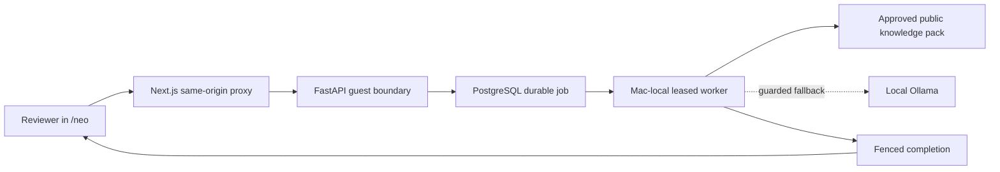

# AI Clone

AI Clone is a privacy-first personal operating system that turns approved knowledge into grounded conversation and routes consequential work through durable, human-controlled agent workflows.

**Live demo:** [Talk with Neo](https://aiclone-frontend-production.up.railway.app/neo)  
The invite code is supplied with the fellowship application.

## Why this is more than a chatbot

- **Durable agent execution:** Railway persists work before a Mac-local worker claims it under a renewable, fenced lease. Interrupted jobs recover without duplicating messages.
- **Grounded retrieval:** guest answers can use only a versioned, owner-approved public knowledge pack. Raw memory, private project files, credentials, and system prompts never enter guest context.
- **Fast, deterministic answers:** ordinary professional questions are rendered directly from selected approved statements, avoiding both model latency and hallucination. A bounded local Ollama model remains an explicit fallback—not a silent provider switch.
- **Human-in-the-loop control:** meeting requests remain pending until the owner approves them. Approval is a recorded decision, not an automatic calendar side effect.
- **Full-stack product engineering:** Next.js, FastAPI, PostgreSQL, macOS `launchd`, local inference, typed schemas, rate limits, HTTP-only guest sessions, and retry-safe APIs work as one system.

## System flow



## Reliability and privacy contracts

The guest path is deliberately fail-closed:

- invite passcodes and session tokens are stored as keyed digests;
- guest, worker, and operator credentials cannot cross authorization boundaries;
- every claim receives an opaque token and renewable lease;
- stale workers cannot overwrite a newer claim;
- retries reuse idempotency keys and cannot create duplicate assistant messages or meeting requests;
- public-knowledge packs require semantic versions and explicit `approved_public` status;
- guest prompts and responses are excluded from local automation logs.

The detailed contract lives in [the Neo conversation SOP](./SOPs/neo_guest_conversation_sop.md), with architectural authority in [SOURCE_OF_TRUTH.md](./SOURCE_OF_TRUTH.md).

## Repository map

| Path | Purpose |
| --- | --- |
| `frontend/` | Next.js reviewer and operator interfaces, HTTP-only session handling, same-origin API proxies |
| `backend/` | FastAPI routes, PostgreSQL persistence, retrieval, authorization, rate limits, and job fencing |
| `scripts/runners/` | Local bounded workers and retry-safe result delivery |
| `knowledge/persona/feeze/public/` | Versioned, explicitly approved guest knowledge |
| `automations/launchd/` | Repository-owned Mac worker definitions |
| `SOPs/` | Operating and release contracts |
| `docs/` | Architecture and security design notes |

## Verification evidence

The current fellowship release passes:

- 190 backend tests;
- 89 focused Neo security, recovery, retrieval, and worker tests;
- a 40-route Next.js production build;
- documentation-authority, persona-canon, repository-hygiene, and route-surface gates;
- live browser verification of access → enqueue → claim → grounded response → durable completion.

Run the local release gate:

```bash
./scripts/verify_main.sh
```

Or run the Neo-focused suite:

```bash
python -m pytest \
  backend/tests/test_neo_public_knowledge_service.py \
  backend/tests/test_neo_guest_security.py \
  backend/tests/test_neo_guest_job_recovery.py
```

## Local development

Use Python 3.11 and Node 20.

```bash
# backend
cd backend
python3 -m venv .venv
source .venv/bin/activate
pip install -r requirements.txt
uvicorn app.main:app --reload --port 3001

# frontend, in another terminal
cd frontend
npm ci
npm run dev -- --port 3000
```

Secrets remain outside Git. The browser never receives the backend control-plane token, and production deployment uses bounded service contexts rather than the entire private workspace.

## Product philosophy

AI Clone is built around a simple idea: useful AI systems need more than prompting. They need trustworthy context, explicit boundaries, durable state, observable execution, and a human who remains accountable for consequential decisions.

Private project — all rights reserved.
